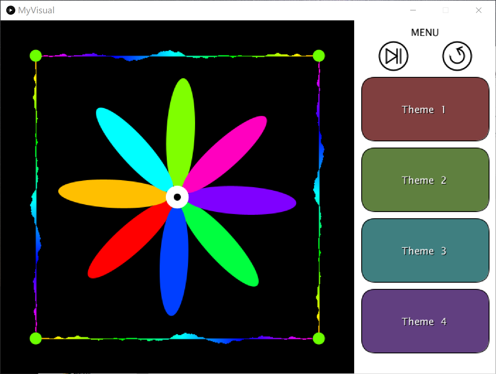
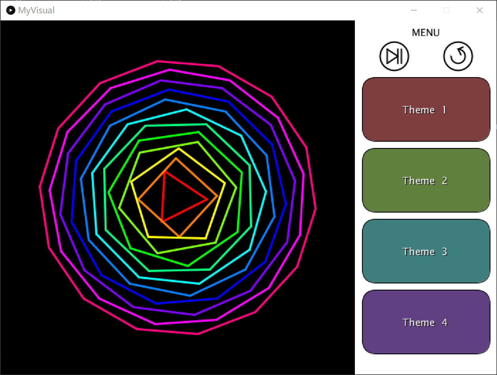

# Music Visualiser Project

Name: Yuhong He

Student Number: C19326053

# Description of the assignment

This assignment is about music visualisation. I created 4 themes that responds to music.

# Instructions

## Control

My assignment could be controlled with both keyboard and mouse. Keyboard SPACE controls the music start or pause. This could also control with the mouse click. In the menu area, I drawed a start/pause and a rewind button, and 4 buttons for every theme. Rewind and theme choose can only control by mouse click.


## Themes

- Theme1: Rotating flower. Flower rotate and the speed is corresponding to the the amplitude, and the length of petals is also respond with amplitude.


- Theme2: Rotating polygons. Triangle with outer rectangle, pentagon, ..., tetradecagon. Each polygon has different colour and size. The rotate speed and the size is respond to the amplitude.


# How it works

# What I am most proud of in the assignment

# Markdown Tutorial

This is *emphasis*

This is a bulleted list

- Item
- Item

This is a numbered list

1. Item
1. Item

This is a [hyperlink](http://bryanduggan.org)

# Headings
## Headings
#### Headings
##### Headings

This is code:

```Java
public void render()
{
	ui.noFill();
	ui.stroke(255);
	ui.rect(x, y, width, height);
	ui.textAlign(PApplet.CENTER, PApplet.CENTER);
	ui.text(text, x + width * 0.5f, y + height * 0.5f);
}
```

So is this without specifying the language:

```
public void render()
{
	ui.noFill();
	ui.stroke(255);
	ui.rect(x, y, width, height);
	ui.textAlign(PApplet.CENTER, PApplet.CENTER);
	ui.text(text, x + width * 0.5f, y + height * 0.5f);
}
```

This is an image using a relative URL:


This is an image using an absolute URL:


# Youtube video

[](https://www.youtube.com/watch?v=iqqzEdw4q5E)