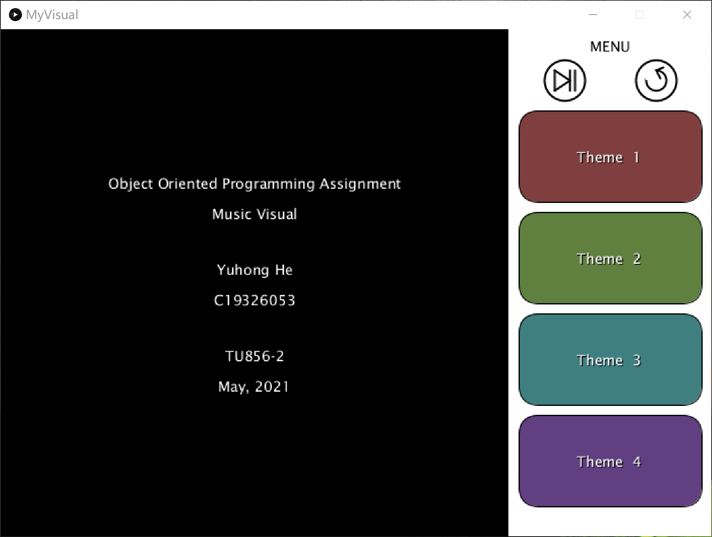
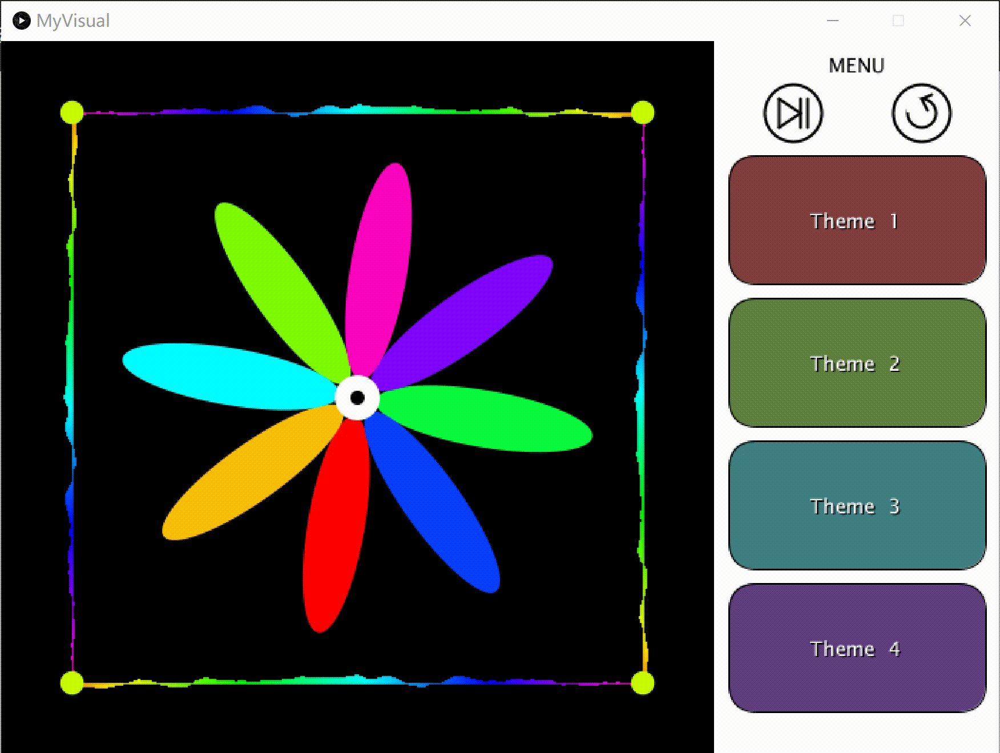
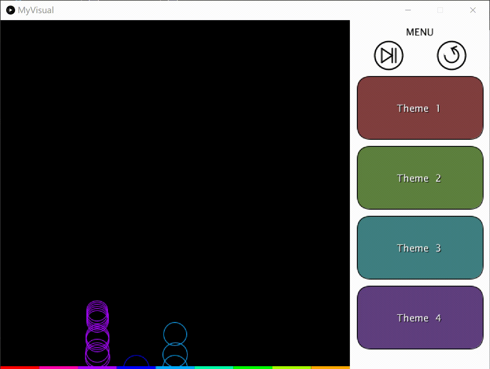

# Music Visualiser Project

Name: Yuhong He

Student Number: C19326053

# Description of the assignment

This assignment is about music visualisation. I created 4 themes that responds to music.

# Instructions

## Control

My assignment could be controlled with both keyboard and mouse. Keyboard SPACE controls the music start or pause. This could also control with the mouse click. In the menu area, I drawed a start/pause and a rewind button, and 4 buttons for every theme. Rewind and theme choose can only control by mouse click.


## Themes

- **Theme1**: Rotating flower. Flower rotate and the speed is corresponding to the the amplitude, and the length of petals is also respond with amplitude.


- **Theme2**: Rotating polygons. Triangle with outer rectangle, pentagon, ..., tetradecagon. Each polygon has different colour and size. The rotate speed and the size is respond to the amplitude.


- **Theme3**: Pitch-circles. This theme divides the music into 9 pitches, when the pitch is playing, the corresponding position generates a circle and the circle goes up.


- **Theme4**: Raining. 7 group of different color bubbles generates respond to the amplitude. Bubbles goes down and swing left and right, look like raining.


# How it works
I have 10 java files in the assignment: Main, MyVisual, Theme1 - 4, Circle, Bubble, Visual and VisualException. In the `Main.java`, it calls `MyVisual.java`, and the `MyVisual.java` calls other java files. The menu and basic settings, such as `loadAudio()`, `draw()`, etc, are in the `MyVisual.java` file. And all the control operation are running in `MyVisual.java`.

## Theme 1
There are two elements in this part, one is the outer border and another is the flower. The border is responds with audio buffer use `getAudioBuffer().get(i)`. And both length and rotate speed of petals in flower are respond to `getSmoothedAmplitude()`.

## Theme 2
I use `cos()` and `sin()` in for loop to form polygons. The size and rotate speed is respond to `getSmoothedAmplitude()`. The outer polygons have faster rotate speed.
```java
for(int i = 3; i < 15 ; i++)
{
    for(int j = 1 ; j <= i ; j ++)
    {
		t2.rotate(rotation * i);
        float theta = TWO_PI / (float) i;
        float change = 50 * i * t2.getSmoothedAmplitude();
        float radius = i * 10 + change;
        float x1 = sin(theta * (j - 1)) * radius;
        float y1 = cos(theta * (j - 1)) * radius;
        float x2 = sin(theta * j) * radius;
        float y2 = cos(theta * j) * radius;
        float c = map(i - 3, 0, 12, 0, 255);
        t2.stroke(c, 255, 255);
        t2.line(0 + x1, 0 + y1, 0 + x2, 0 + y2);
    }
}
```

## Theme 3
In this theme I use another file `Circle.java` to help me generate lots of circles. I create an `ArrayList` of circle first, and form new circle if the pitch voice is obvious. The circles goes up, and the size became small and small.

```java
for(int i = 0 ; i < t3.getSmoothedBands().length ; i ++)
{
    float color = map(i, 0, t3.getBands().length, 255, 0);
    if(t3.getBands()[i] > 180)
    {
        Circle c = new Circle(i * gap + gap / 2, t3.height, gap - 20, color);
        circle.add(c);
    }
}
```

## Theme 4
In this theme I use another file `Bubble.java` to help me generate lots of bubbles. I create an `ArrayList` of bubble first, and form new bubble if the music has voice. I use `getSmoothedBands()[1] > 0` to express this. Bubbles are appear at the top round point, and goes down, the x-coordinates is also changed randomly.

# What I am most proud of in the assignment
I practiced a lot on concepts of Object Oriented during the assignment, now I understood how the object works in different classes. I'm proud of all my code is working and achieve the visual what I want. My favourate part of the assignment is the theme 3.

# Youtube video

[](https://www.youtube.com/watch?v=iqqzEdw4q5E)